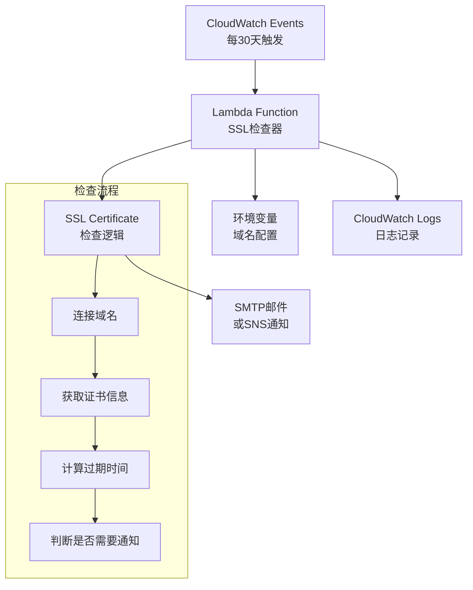

# SSL Certificate Monitor Design Document

## Overview

SSL证书过期检查器是一个基于AWS Lambda的轻量级监控系统。系统通过CloudWatch Events定时触发Lambda函数，检查硬编码在环境变量中的域名列表。当发现即将在30天内过期的证书时，系统会通过简单的SMTP邮件或SNS发送通知。

## Architecture

### High-Level Architecture



### AWS Services Integration

1. **AWS Lambda**: 核心执行环境，运行SSL检查逻辑
2. **CloudWatch Events**: 定时触发器，每30天执行一次（比EventBridge更简单）
3. **环境变量**: 直接在Lambda中配置域名列表（适合小规模使用）
4. **SMTP邮件 或 SNS**: 发送通知（可选择更简单的方案）
5. **CloudWatch Logs**: 自动记录日志（Lambda内置功能）

## Components and Interfaces

### 1. Lambda Function Handler

**职责**: 主要入口点，协调整个检查流程

**接口**:
```python
def lambda_handler(event, context):
    """
    Lambda函数入口点
    Args:
        event: EventBridge触发事件
        context: Lambda运行时上下文
    Returns:
        dict: 执行结果和统计信息
    """
```

### 2. Domain Configuration Manager

**职责**: 管理需要监控的域名列表

**接口**:
```python
class DomainConfigManager:
    def get_domains(self) -> List[str]:
        """从环境变量获取域名列表（逗号分隔）"""
    
    def validate_domain(self, domain: str) -> bool:
        """验证域名格式"""
```

### 3. SSL Certificate Checker

**职责**: 检查SSL证书状态和过期时间

**接口**:
```python
class SSLCertificateChecker:
    def check_certificate(self, domain: str) -> CertificateInfo:
        """检查单个域名的SSL证书"""
    
    def get_certificate_expiry(self, domain: str) -> datetime:
        """获取证书过期时间"""
    
    def calculate_days_until_expiry(self, expiry_date: datetime) -> int:
        """计算距离过期的天数"""
```

### 4. Email Notification Service

**职责**: 发送邮件通知

**接口**:
```python
class EmailNotificationService:
    def send_expiry_notification(self, expiring_domains: List[CertificateInfo]) -> bool:
        """通过SMTP或SNS发送证书过期通知"""
    
    def format_email_content(self, domains: List[CertificateInfo]) -> str:
        """格式化邮件内容"""
    
    def send_via_smtp(self, content: str) -> bool:
        """使用SMTP发送邮件（如Gmail）"""
    
    def send_via_sns(self, content: str) -> bool:
        """使用SNS发送通知（可选）"""
```

### 5. Logger Service

**职责**: 统一日志记录

**接口**:
```python
class LoggerService:
    def log_check_start(self, domain_count: int):
        """记录检查开始"""
    
    def log_certificate_info(self, domain: str, cert_info: CertificateInfo):
        """记录证书信息"""
    
    def log_error(self, domain: str, error: Exception):
        """记录错误信息"""
```

## Data Models

### CertificateInfo

```python
@dataclass
class CertificateInfo:
    domain: str
    expiry_date: datetime
    days_until_expiry: int
    issuer: str
    is_valid: bool
    error_message: Optional[str] = None
    
    @property
    def is_expiring_soon(self) -> bool:
        """判断是否即将过期（30天内）"""
        return 0 <= self.days_until_expiry <= 30
    
    @property
    def is_expired(self) -> bool:
        """判断是否已过期"""
        return self.days_until_expiry < 0
```

### CheckResult

```python
@dataclass
class CheckResult:
    total_domains: int
    successful_checks: int
    failed_checks: int
    expiring_domains: List[CertificateInfo]
    expired_domains: List[CertificateInfo]
    errors: List[str]
    execution_time: float
```

## Error Handling

### 1. Network Connectivity Issues

- **超时处理**: 设置合理的连接超时时间（10秒）
- **重试机制**: 对临时网络错误进行重试（最多3次）
- **错误记录**: 记录无法连接的域名和具体错误信息

### 2. SSL Certificate Issues

- **证书无效**: 捕获SSL验证错误，记录但不中断处理
- **证书格式错误**: 处理证书解析异常
- **证书链问题**: 记录证书链验证失败的情况

### 3. AWS Service Issues

- **环境变量读取失败**: 使用内置的默认域名列表作为备选
- **邮件发送失败**: 记录邮件发送错误，但不影响检查流程
- **Lambda超时**: 优化执行时间，必要时分批处理域名

### 4. Data Validation

- **域名格式验证**: 使用正则表达式验证域名格式
- **配置参数验证**: 验证邮件地址和其他配置参数
- **输入清理**: 清理和标准化输入的域名

## Testing Strategy

### 1. Unit Tests

- **SSL检查逻辑**: 测试证书获取和过期时间计算
- **邮件格式化**: 测试邮件内容生成
- **域名验证**: 测试域名格式验证逻辑
- **错误处理**: 测试各种异常情况的处理

### 2. Integration Tests

- **邮件服务集成**: 测试SMTP或SNS邮件发送功能
- **端到端流程**: 测试完整的检查和通知流程
- **错误场景**: 测试网络错误和服务不可用的情况

### 3. Performance Tests

- **并发检查**: 测试同时检查多个域名的性能
- **超时处理**: 验证超时机制的有效性
- **内存使用**: 监控Lambda函数的内存使用情况

### 4. Security Tests

- **输入验证**: 测试恶意域名输入的处理
- **权限验证**: 确保Lambda函数具有最小必要权限
- **敏感信息**: 确保不在日志中泄露敏感信息

## Deployment Configuration

### Lambda Function Configuration

- **Runtime**: Python 3.9+
- **Memory**: 128 MB
- **Timeout**: 3分钟
- **Environment Variables**:
  - `DOMAINS`: 域名列表（逗号分隔，如："example.com,test.com"）
  - `NOTIFICATION_EMAIL`: 通知邮件地址
  - `SMTP_SERVER`: SMTP服务器（可选，如："smtp.gmail.com"）
  - `SMTP_PORT`: SMTP端口（可选，如："587"）
  - `SMTP_USERNAME`: SMTP用户名（可选）
  - `SMTP_PASSWORD`: SMTP密码（可选）
  - `USE_SNS`: 是否使用SNS（可选，默认false）
  - `SNS_TOPIC_ARN`: SNS主题ARN（可选）

### IAM Permissions

Lambda函数需要以下最小权限：
- `logs:CreateLogGroup`, `logs:CreateLogStream`, `logs:PutLogEvents` - 写入日志
- `sns:Publish` - 发送SNS通知（仅在使用SNS时需要）

### CloudWatch Events Rule

- **Schedule Expression**: `rate(30 days)`
- **Target**: SSL Certificate Monitor Lambda Function
- **Input**: 空的JSON对象 `{}`